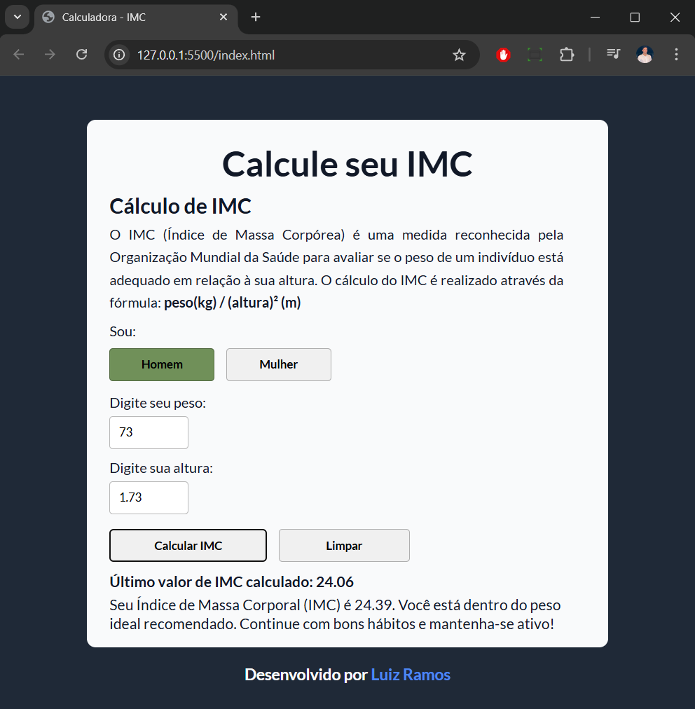

# Calculadora-IMC

Projeto desenvolvido para calcular o Índice de Massa Corporal (IMC) de forma simples e prática, utilizando HTML, CSS e JavaScript.  
O IMC é uma medida reconhecida pela Organização Mundial da Saúde que ajuda a avaliar se o peso de uma pessoa está adequado em relação à sua altura.

---

## 📸 Demonstração



---

## 🚀 Funcionalidades

- Inserção de **peso** e **altura**
- Seleção de **sexo (Homem ou Mulher)**
- Cálculo do **IMC** com mensagens diferentes por sexo
- **Validação de dados** (peso e altura obrigatórios, altura aceita com vírgula ou ponto)
- Exibição de mensagens com base no resultado
- Armazenamento do **último resultado usando o localStorage**
- Botão para **limpar os dados e a interface**
- Estilização com **cores, responsividade e efeitos de hover**

---

## 🧪 Tecnologias utilizadas

- HTML5  
- CSS3 (com variáveis CSS para cores e estilo)  
- JavaScript (ES6)  
- `localStorage` para salvar o último IMC calculado  
- Git e GitHub para versionamento  
- GitHub Pages para hospedagem online  

---

## 🌐 Acesso ao projeto

O projeto está hospedado no GitHub Pages e pode ser acessado em:  
[https://luizramosh.github.io/calculadora-imc/](https://luizramosh.github.io/calculadora-imc/)

---

## 💡 Como usar

1. Preencha os campos de **peso** e **altura**.
2. Clique em **Homem** ou **Mulher** para selecionar o sexo.
3. Clique em **Calcular**.
4. O resultado do IMC será exibido com uma mensagem específica.
5. Use o botão **Limpar** para resetar o formulário.

## 📁 Estrutura do Projeto

```
📁 projeto-imc/
├── index.html
├── style.css
└── script.js
```
# 📬 Contato

Desenvolvido por Luiz Ramos  
**luizramosh@hotmail.com**

Ou visite meu [LinkedIn](https://linkedin.com/in/luizramosh)
